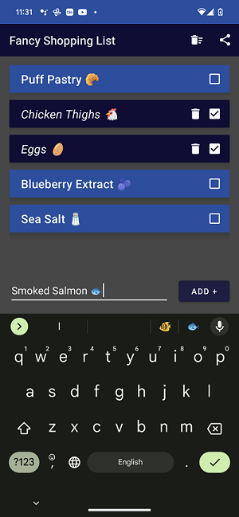
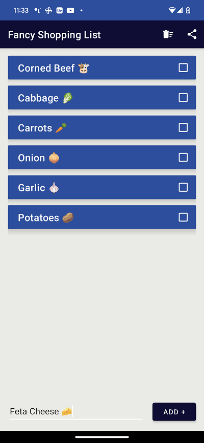

# Fancy Shopping List

## Inspiration

This app was created to explore the use of Java for creating Android applications. The goal was simple - create an application that runs efficiently, is easy to use, and can be used in the real world.

Throughout the learning process, many Java projects demonstrate the abilities of the language, but are not usable for real life applications. A "banking app" or "school manager" show the powers of object-oriented-programming, but they served no actual purpose. These projects could not be shared with friends, family, or others.

So I created the **_Fancy Shopping List._** If you're as forgetful as I am, then it's important to create a list before heading to the store. Otherwise you end up items such as _mini frozen tacos_ or _pumpkin pie twinkies_, instead of essentials like eggs and milk. You may use a "note" app on your phone, but that may be cumbersome. Also, many existing apps are completely polluted with ads. But not the **_Fancy Shopping List._** That would be different.

## Goals

This app needed to be about as simple as it gets. It needed just five basic functions:

1. Create or add a new list item.
2. Check off a list item.
3. Delete an old list itme.
4. Simply share a list with a friend or partner.
5. Lists must persist data.

## Design

The app features a very simple UI that will be familiar to all. The theme adapt to your phone for use in _light_ or _dark_ theme modes:

## Construction

The app was built in _Android Studio_ and is programmed with Java. A few key functions are:

- The item list is created using Android's **_RecyclerView_**
- List items are persisted using Android's **_SharedPreferences_**, which are saved during app "onStop" and loaded during app "onCreate"
- Lists are shared by creating a string version of the list, then creating a share "Intent" which allows sharing of the list in messaging apps.

## Results

The **_Fancy Shopping List_** performs excellently! The objectives above were met, it's very easy to operate, and is extremely useful. The application is very effient and allows me to share shopping lists with my wife!

I look forward to building upon this application in the future as well creating more useful Android applications.

## Future Considerations

In the future I would like to make this application more accessible. An iPhone version of the app would make it available to many more users.

Additionally, I would like the shopping lists to be shareable directly to the application on another device (as opposed to sharing a text string).
